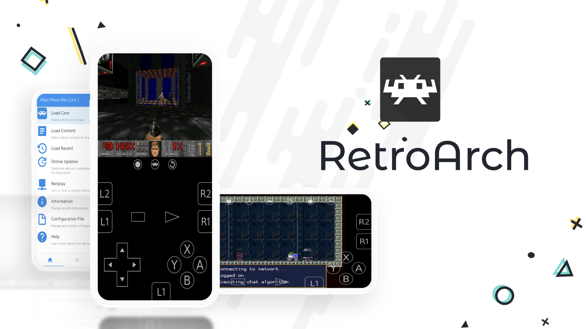
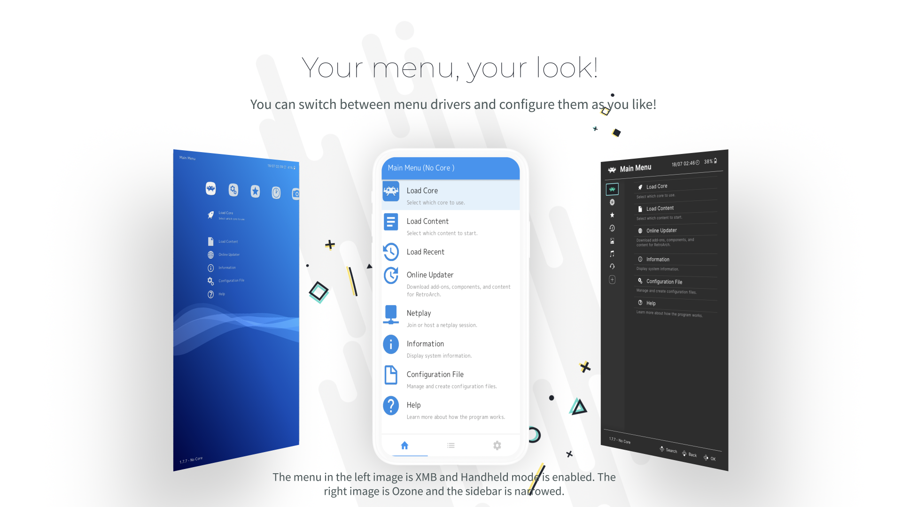
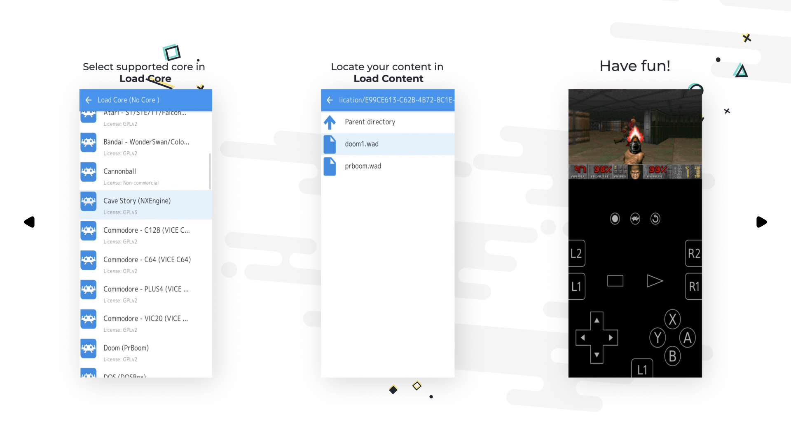
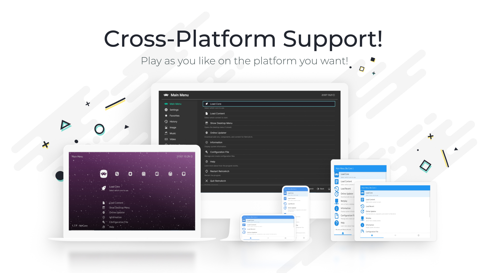

# RetroArch's Scene

RetroArch users from almost every language use it on many different platforms, including Android. If you didn’t know, RetroArch has been downloaded more than 1 million times from the Google Play Store! We are grateful to all our users, no matter which platform you are on!!! With RetroArch Scene, our goal is to localize platform descriptions. In this Repo you will find pictures, store/page descriptions and some assets of the languages and you can edit them as you like.

We have recently begun to translate RetroArch’s description into several languages. Like RetroArch itself, we hope that the marketplaces/pages will be available in many languages. 

